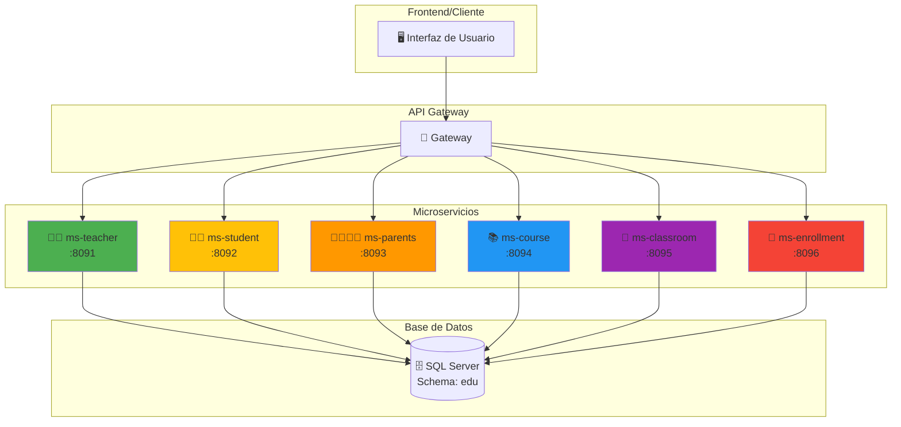
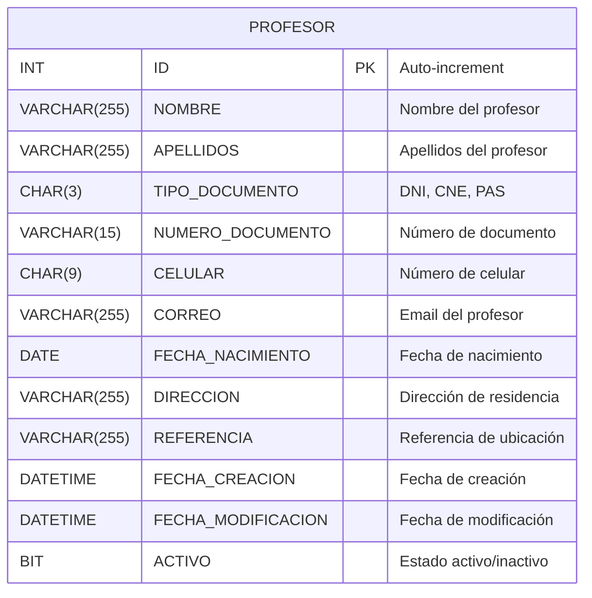

# 🏫 Sistema de Gestión de Institución Educativa

[](https://spring.io/projects/spring-boot)
[](https://openjdk.org/projects/jdk/17/)
[](https://www.microsoft.com/en-us/sql-server)

## 📋 Tabla de Contenidos

- [📖 Descripción del Proyecto](#-descripción-del-proyecto)
- [🏗️ Arquitectura del Sistema](#️-arquitectura-del-sistema)
- [🧩 Microservicios](#-microservicios)
- [🗄️ Base de Datos](#️-base-de-datos)
- [🚀 Instalación y Configuración](#-instalación-y-configuración)
- [🔌 API Endpoints](#-api-endpoints)
- [📝 Ejemplos de Uso](#-ejemplos-de-uso)

---

## 📖 Descripción del Proyecto

El **Sistema de Gestión de Institución Educativa** es una solución basada en microservicios desarrollada con **Spring Boot** y **Spring WebFlux**. El sistema gestiona profesores, estudiantes, padres, cursos, aulas y matrículas de una institución educativa.

---

## 🏗️ Arquitectura del Sistema



### 🏛️ Patrón de Arquitectura

El proyecto sigue **Clean Architecture** con las siguientes capas:
- **Infrastructure**: Controllers y Repositories
- **Application**: Services y DTOs
- **Domain**: Entities e Interfaces

---

## 🧩 Microservicios

### 🎯 Estado de Desarrollo

| Microservicio | Estado | Puerto | Descripción |
|---------------|--------|--------|-------------|
| **👨‍🏫 ms-teacher** | ✅ **Completado** | 8091 | Gestión de profesores |
| **👨‍🎓 ms-student** | 🚧 En desarrollo | 8092 | Gestión de estudiantes |
| **👨‍👩‍👧‍👦 ms-parents** | 🚧 En desarrollo | 8093 | Gestión de padres de familia |
| **📚 ms-course** | 🚧 En desarrollo | 8094 | Gestión de cursos y materias |
| **🏫 ms-classroom** | 🚧 En desarrollo | 8095 | Gestión de aulas |
| **📝 ms-enrollment** | 🚧 En desarrollo | 8096 | Gestión de matrículas |

---

## 👨‍🏫 Microservicio: ms-teacher

###  Componentes Principales

#### 🏗️ Entidad Teacher
- Mapea a la tabla `edu.PROFESOR`
- Contiene información básica del profesor
- Maneja estados activo/inactivo

#### 🌐 API REST Controller
Expone endpoints para operaciones CRUD y gestión de estados.

| Método | Endpoint | Descripción |
|--------|----------|-------------|
| `GET` | `/api/v1/teachers/all` | Obtener todos los profesores |
| `GET` | `/api/v1/teachers/active` | Obtener profesores activos |
| `GET` | `/api/v1/teachers/inactive` | Obtener profesores inactivos |
| `GET` | `/api/v1/teachers/{id}` | Obtener profesor por ID |
| `POST` | `/api/v1/teachers/create` | Crear un profesor |
| `POST` | `/api/v1/teachers/create/all` | Crear múltiples profesores |
| `PUT` | `/api/v1/teachers/{id}` | Actualizar profesor completo |
| `PATCH` | `/api/v1/teachers/{id}` | Activar profesor |
| `DELETE` | `/api/v1/teachers/{id}` | Desactivar profesor |

---

## 🗄️ Base de Datos

### 📊 Esquema de Base de Datos



### 📝 Script de Creación de Base de Datos

```sql
-- Crear esquema de la base de datos educativa
CREATE SCHEMA edu;

-- Tabla de Profesores
CREATE TABLE edu.PROFESOR (
    ID INT IDENTITY(1,1),
    NOMBRE VARCHAR(255) NOT NULL,
    APELLIDOS VARCHAR(255) NOT NULL,
    TIPO_DOCUMENTO CHAR(3) NOT NULL,
    NUMERO_DOCUMENTO VARCHAR(15) NOT NULL UNIQUE,
    CELULAR CHAR(9),
    CORREO VARCHAR(255) UNIQUE,
    FECHA_NACIMIENTO DATE,
    DIRECCION VARCHAR(255),
    REFERENCIA VARCHAR(255),
    FECHA_CREACION DATETIME DEFAULT GETDATE(),
    FECHA_MODIFICACION DATETIME DEFAULT GETDATE(),
    ACTIVO BIT DEFAULT 1,
    
    CONSTRAINT PK_PROFESOR PRIMARY KEY (ID),
    CONSTRAINT CHK_TIPO_DOCUMENTO CHECK (TIPO_DOCUMENTO IN ('DNI', 'CNE', 'PAS'))
);
```

---

## 🚀 Instalación y Configuración

### 📋 Prerrequisitos
- Java 17+
- Gradle 8.x
- SQL Server
- Git

### 🔽 Pasos de Instalación

1. **Clonar el repositorio**:
```bash
git clone <URL_DEL_REPOSITORIO>
cd educational-institution
```

2. **Configurar base de datos**:
- Crear base de datos `EducationalInstitution`
- Ejecutar script SQL de la sección anterior

3. **Variables de entorno**:
```bash
DB_HOST=localhost
DB_PORT=1433
DB_NAME=EducationalInstitution
DB_USERNAME=tu_usuario
DB_PASSWORD=tu_contraseña
```

4. **Ejecutar ms-teacher**:
```bash
./gradlew :ms-teacher:bootRun
```

---

## 🔧 Tecnologías Utilizadas

- **Spring Boot 3.5.3** - Framework principal
- **Spring WebFlux** - Programación reactiva
- **Spring Data R2DBC** - Acceso reactivo a base de datos
- **Lombok** - Reducción de código boilerplate
- **SQL Server** - Base de datos relacional
- **Gradle** - Gestión de dependencias

---

## 🔌 API Endpoints

### 👨‍🏫 ms-teacher (Puerto: 8091)

| Método | Endpoint | Descripción |
|--------|----------|-------------|
| `GET` | `/api/v1/teachers/all` | Listar todos los profesores |
| `GET` | `/api/v1/teachers/active` | Listar profesores activos |
| `GET` | `/api/v1/teachers/{id}` | Obtener profesor por ID |
| `POST` | `/api/v1/teachers/create` | Crear nuevo profesor |
| `PUT` | `/api/v1/teachers/{id}` | Actualizar profesor |
| `PATCH` | `/api/v1/teachers/{id}` | Activar profesor |
| `DELETE` | `/api/v1/teachers/{id}` | Desactivar profesor |

---

## 📝 Ejemplos de Uso

**Base URL:** `http://localhost:8091`

### Crear un Profesor
```bash
curl -X POST http://localhost:8091/api/v1/teachers/create \
  -H "Content-Type: application/json" \
  -d '{
    "name": "Juan",
    "lastName": "Pérez López",
    "documentType": "DNI",
    "documentNumber": "12345678",
    "cellPhone": "987654321",
    "email": "juan.perez@example.com",
    "birthDate": "1985-03-15",
    "address": "Av. Los Educadores 123",
    "reference": "Cerca al parque central"
  }'
```

### Obtener Profesores Activos
```bash
curl -X GET http://localhost:8091/api/v1/teachers/active
```

### Actualizar Profesor
```bash
curl -X PUT http://localhost:8091/api/v1/teachers/1 \
  -H "Content-Type: application/json" \
  -d '{
    "name": "Juan Carlos",
    "lastName": "Pérez López",
    "email": "juan.carlos@example.com"
  }'
```

---

## 🚨 Notas Importantes

> **⚠️ Importante**: Asegúrate de que SQL Server esté ejecutándose y las variables de entorno estén configuradas antes de iniciar los microservicios.

> **� Nota**: Los microservicios usan programación reactiva (WebFlux), las operaciones retornan `Mono` o `Flux`.

### � Estado del Proyecto

| Microservicio | Estado |
|---------------|--------|
| **ms-teacher** | ✅ Completo |
| **ms-student** | 🚧 En desarrollo |
| **ms-parents** | 🚧 En desarrollo |
| **ms-course** | 🚧 En desarrollo |
| **ms-classroom** | 🚧 En desarrollo |
| **ms-enrollment** | 🚧 En desarrollo |

---

## 📞 Contacto

- **👨‍💻 Desarrollador**: Miguel Cuadros
- **🐙 GitHub**: MiguelCuadros

---

**🎉 ¡Gracias por usar el Sistema de Gestión de Institución Educativa!**
